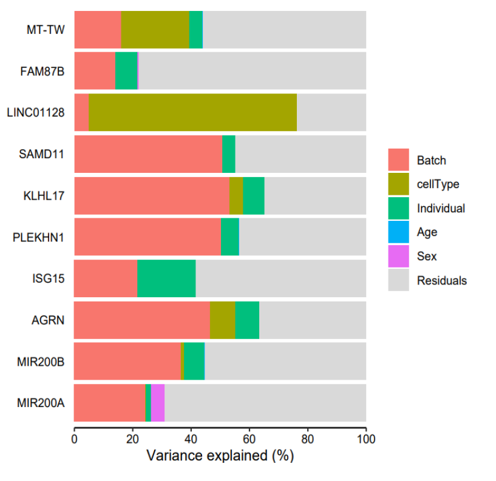
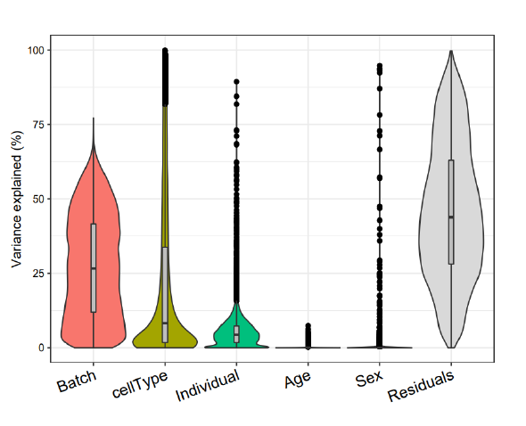

# variancePartition
### Application of variancePartition R package on immVar dataset

immVar: The Immune Variation (immVar) project gives the information about the variation extent in the healthy human immune function subjects. The authors (De Jager, et al, 2015) of this project aimed at mapping genetic architecture of both adaptive and innate immunologic transcriptomes across human population. They dealt with analyzing genetic variation in the immune transcriptome. The project also aimed at quantifying the variance that eventually help future studies of immune function in health and disease.

variancePartition: The variancePartition package provides the information about the driving factors of variation in the gene expression patterns. A typical design where this package was useful was a gene expression from individuals from various tissues or cell types. The ultimate goal is to understand the variation between the

Package installation: https://bioconductor.org/packages/release/bioc/html/variancePartition.html

Dataset description: https://github.com/GabrielHoffman/vptest

Metadata file and the expression datafile was downloaded from the shared GitHub repository at: https://github.com/GabrielHoffman/vptest

### Analysis

Initially, I was able to play with the simulated data in the R package variancePartition. After reproducing the results using the simulated and reading the variancePartition paper I started analyzing the immVar datasets.

In the dataset ppData, it was observed that the affymetrix microarray probe ids are retained as it is. After transposing the ppData file I downloaded the file GPL6244-17930.txt file at https://www.ncbi.nlm.nih.gov/geo/query/acc.cgi?acc=GPL6244. This .txt file contains columns with probe ids and the corresponding gene names. I have used Python Pandas library to convert affymetrix microarray probe ids into gene names (Jupyter Notebook immVar.ipynb). variancePartition package in R was used after preparing the expression matrix.

### Results

  
   

