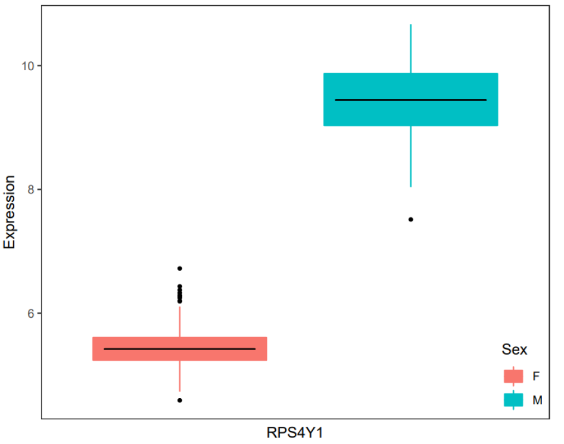
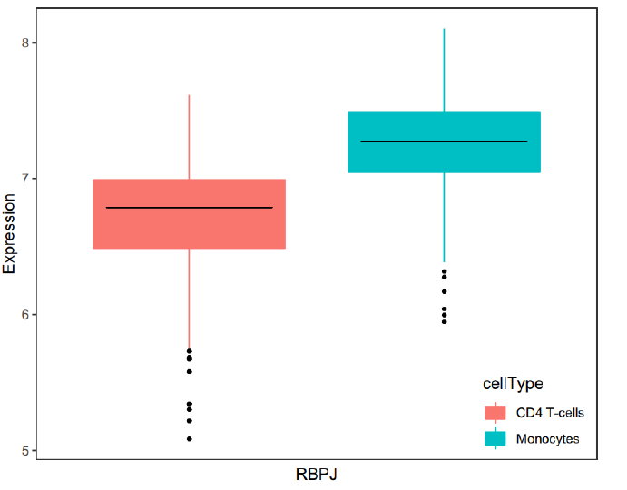
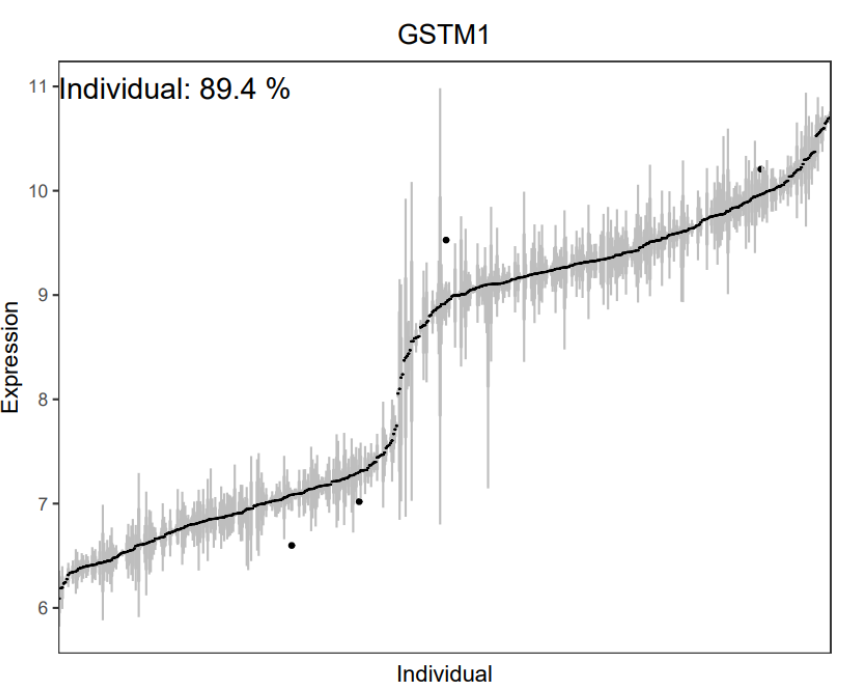

# variancePartition
### Application of variancePartition R package on immVar dataset

immVar: The Immune Variation (immVar) project gives the information about the variation extent in the healthy human immune function subjects. The authors (De Jager, et al, 2015) of this project aimed at mapping genetic architecture of both adaptive and innate immunologic transcriptomes across human population. They dealt with analyzing genetic variation in the immune transcriptome. The project also aimed at quantifying the variance that eventually help future studies of immune function in health and disease.

variancePartition: The variancePartition package provides the information about the driving factors of variation in the gene expression patterns. A typical design where this package was useful was a gene expression from individuals from various tissues or cell types. The ultimate goal is to understand the variation between the

Package installation: https://bioconductor.org/packages/release/bioc/html/variancePartition.html

Dataset description: https://github.com/GabrielHoffman/vptest

Metadata file and the expression datafile was downloaded from the shared GitHub repository at: https://github.com/GabrielHoffman/vptest

### Analysis

Initially, I was able to play with the simulated data in the R package variancePartition. After reproducing the results using the simulated and reading the variancePartition paper I started analyzing the immVar datasets.

In the dataset ppData, it was observed that the affymetrix microarray probe ids are retained as it is. After transposing the ppData file I downloaded the file GPL6244-17930.txt file at https://www.ncbi.nlm.nih.gov/geo/query/acc.cgi?acc=GPL6244. This .txt file contains columns with probe ids and the corresponding gene names. I have used Python Pandas library to convert affymetrix microarray probe ids into gene names (Jupyter Notebook immVar.ipynb). variancePartition package in R was used after preparing the expression matrix.

### Results

  
   

    <em>Plot Description</em>

Initially, the formula was fixed using both a fixed effect and the random effects. Here, batch, cellType, Sex and individual are random effects, and they are categorical in nature. The expression dataset includes 984 samples with more than 30000 probe ids. Variation due to every aspect of the study design with respect to each gene expression was analyzed. The results will give information at gene level that goes with or deviate from the genome wide trend. A linear mixed model was used in this analysis. The above box plots provide information about percent variation in the gene expression by each variable. It was observed that the multiple variables contribute to expression variation in this dataset. It was observed that the variation across the cell types was more than followed by the individual. It is also observed that the sex accelerated variation in a smaller number of genes whereas age showed negligible effect on gene expression. Although the effect due to batch is much higher in this expression dataset, biological variation across cell types, individual is more meaningful.

  

    <em>Expression of RPS4Y1 by sex </em>

  

Variation aims to identify genes that vary along different aspects of the experimental design. It was observed that the gene RPS4Y1 showed strong expression difference when stratified by sex. This expression was more in males than females.

  
   

   <em>Expression of RBPJ gene stratified by the cell type      ||        Expression of GSTM1 stratified by individual</em>

